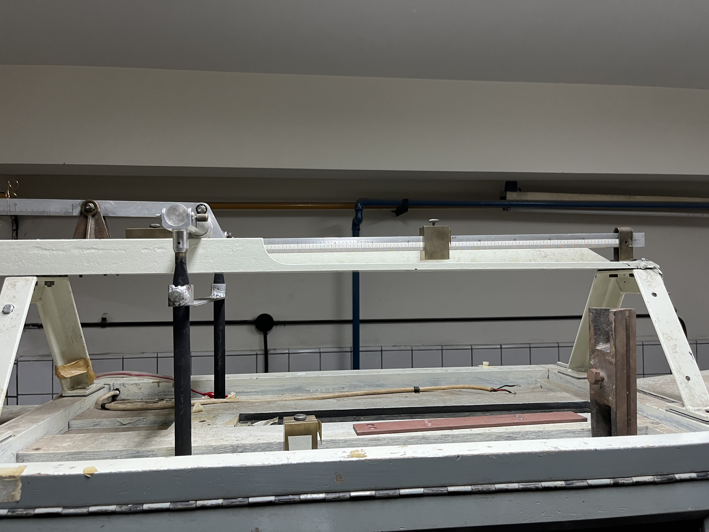
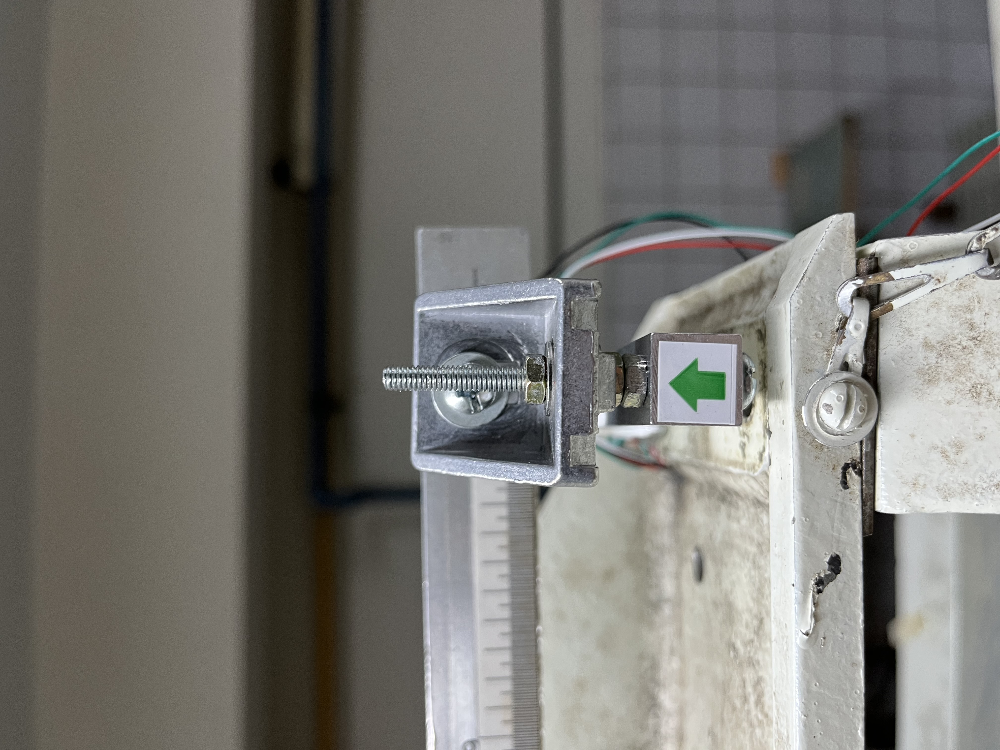

# Operation of the balance

| Former system | New System | 
|:-:|:-:|
|||
---------

### The balance works with a gauge sensor [HX711](https://github.com/fluidodinamica/balance_tunel_de_viento/blob/main/IMG-0959.jpg) operating on Wheastone bridge principles. 

### It is important to verify that all screws or bolts of the measurement system are firmly fasten. 

### The sensor measures a weight which is saved by an arduino card with the [program of acquisition](https://github.com/fluidodinamica/balance_tunel_de_viento/blob/main/_talonnage_masse.ino).

### An important parameter of the program is the "set_scale" variable, as it relies on the calibration of the sensor.

### In order to save measurements to the disk drive,  a software called  [CoolTerm] (https://coolterm.en.lo4d.com/windows) is applied. 

### The acquisition frequency of the sensor is around 10 Hz. 

### From the weight values of the sensor  values of drag force are obtained from  fundamental principle of statics as depicted on the following figure:

  

 

### According to the different forces undergone by the balance, the following equation results:

$$\boxed{F_D = 12.63\cdot10^{-3} \times weight_{arduino}}$$
 

### We tested the device in the "Tango" Wind Tunnel .  We  measure the drag force of a circular cylinder for a range of velocities and compared the result with reference values ([link for the values](https://github.com/fluidodinamica/balance_tunel_de_viento/blob/main/Values%20drag%20force.csv)):

  

 

### We noticed a gap between the reference and our experimental values. The gap can be overcoma by taking acount the drag force of the model support. Indeed by measuring the drag froce of the model support alone, we find the following values :

  

 

### Now, by substracting the weight measured for the model support alone respect to the weight measured for the model, we find the drag force of the cylinder much closer of the reference values ([link for the values](https://github.com/fluidodinamica/balance_tunel_de_viento/blob/main/Values%20drag%20force%20without%20support.csv)): 

  

 

### The values measured by the sensor varied always due to the repeatability uncertainty. We measured this uncertaintly, we found a weight uncertainty of 0,0246 g so a drag force uncertainty of 0,00031 N. 

